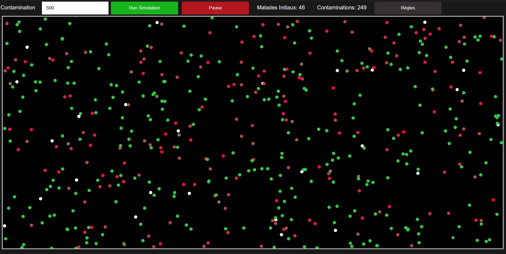

# Contamination

Contamination is a *little side project*, that I did to learn JS (with HTML). This project is an **epidemic simulation** to model the spread of a virus through a population.
> *This is not a serious project and should not be used for real studies.*

## Features

- **Propagation modeling**: Probabilistic propagation, based on symptoms and age.
- **Customizable parameters**: Adjust population size. *Other parameters to come*.
- **Visualization**: Real-time monitoring of epidemic evolution using statistics and the simulation visual.
- **Statistics**: Calculation of key statistics such as initial number of patients and contaminations.



